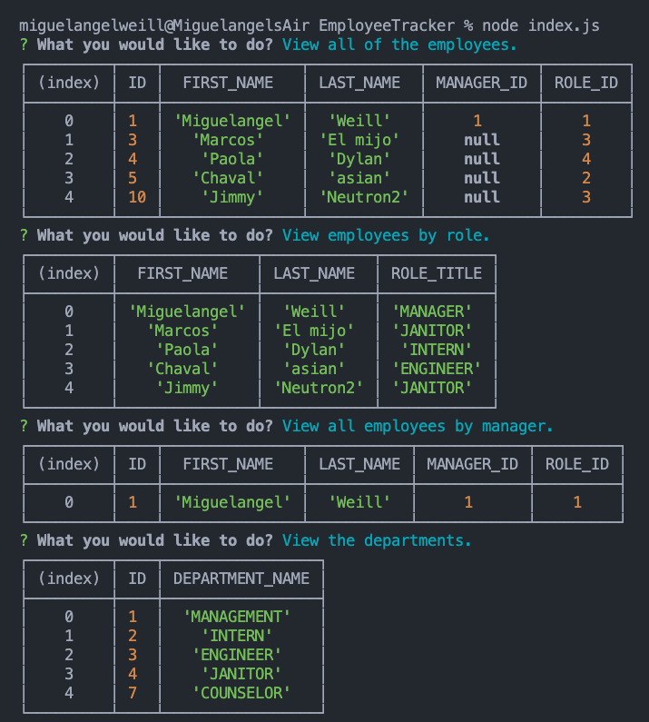

# Employee Tracker

## license


## Description

This is an application that allows a company to keep track of all of they employees that exist inside of it.

- This application allow's the user to add employees, dep
  artment and roles to they're respective work place, we also give you the oprotunity to remove or update all of the data that you have inserted into
  the application.
- This is a node command line application.

  

## MySQL tables


## Table of contents

- [Description](#Description)
- [Installation](#Installation)
- [Usage](#Usage)
- [Licence](#License)
- [Contributors](#Contributors)
- [Test](#Test)
- [Repository Link](#Repository)
- [GitHub Info](#GitHub)

  ## Installation

  - Clone the reposatory into a local file in you're computer.
  - run "npm i" inside of the terminal.

  ## Usage

- This application uses MySQL workbench as the database to store the information about the company and the employee's.
- This is a node application that uses inquirer to retrieve information from the user. Using the information that is retrieve to run a different set of query's to the database depending on the action that the user wishes to make.
- To end the applicatin select the option of "Exit" this will kill your server and exit the application;
 ## Directory 
 ```
 Assets/        //This contains the my "db" and "image" folder.
 db/            //Here I keep the schemas.sql & seeds.sql file's.
 images/        //The images that are being used inside of the README.md.
 index.js/      //This is the entry point for the application

 ```
  ## Constributors

  Miguelangel Weill

  ## Test

  

  ## Git hub user name

  miguelangelWeill

  ## Repository


[Git hub profile](https://api.github.com/users/Miguelangelweill)

[This is my Git Hub repository](https://github.com/Miguelangelweill)
